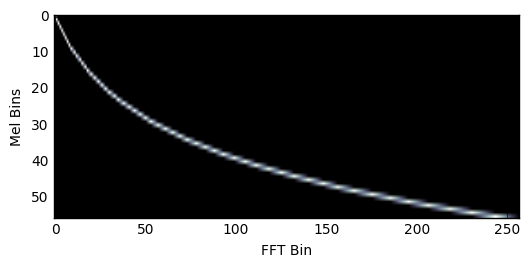

# Preprocessing Pipeline

This folder houses the code needed to run the data preprocessing pipeline.
This pipeline is responsible for converting the raw waveforms to short-time
Fourier transformed (stft) spectrograms and organizing these spectrograms in a
sensible manner for later partitioning.
It's currently capable of running over the LibriSpeech and UrbanSound8K
datasets.
However, it's possible to run over other datasets with only a few alterations to
the pipeline script and settings file.

## Usage

The `preprocess_data.py` script is used to run the preprocessing pipeline.
This script takes as arguments a preprocessing settings file, logging
configuration file, and logger name.
Argument names can be displayed by running the script with the `--help` or `-h`
flag.
The most pertinent argument is the preprocessing settings JSON file; a template
of which can be found in `magnolia/settings/preprocessing_template.json`.
The structure of the JSON file is as follows:

```javascript
{
  "data_directory": "...", // path to "top-level" directory where data resides
  "metadata_file": "...", // file containing the metadata regarding the dataset (discussed later)
  "dataset_type": "...", // unique identifying string for this dataset (discussed later)
  "spectrogram_output_file": "...", // spectrogram output HDF5 file name (with file extension)
  "waveform_output_file": "...", // waveform output HDF5 file name (with file extension)
  "metadata_output_file": "...", // metadata output file name (with file extension)
  "compression": "...", // compression algorithm to use (HDF5 dataset parameter)
  "compression_opts": 0, // compression option (HDF5 dataset parameter)
  "processing_parameters": {
    "preemphasis_coeff": 0.95,
    "target_sample_rate": 10000,
    "stft_args": {
      "n_fft": 512
    }
  }
}
```

For a complete description of the `processing_parameters`, see the definition of
the `make_stft_dataset` function in `preprocessing.py`.
The `stft_args` are passed directly to the `librosa` library's `stft` function.

The output spectrogram HDF5 file should contain the stft spectrograms structured
in such a way that it's convenient for partitioning and iteration in later steps
(i.e. training, etc.).

### Customization for new datasets

Most of the alterations needed for a new dataset are made to the preprocessing
settings JSON file.
However, one important change needs to be made to the `preprocess_data.py`
script.
If the output file is to have any hierarchical structure, a new "metadata
handler" class must be created.
The primary purpose of this class is to create an HDF5 key and dataset name
given the dataset metadata and the file name of an input file.
It can also save custom metadata after the data has been processed.
The class needs three methods: the `__init__` method which takes as it's only
argument the metadata file name (`metadata_file` from the setting file), a
`process_file_metadata` method that return a key and dataset name given an input
file name, and a `save_metadata` method that may save a file containing the
metadata given the meatadata file name.
The name of the class is also important.
It's name should be formatted as `dataset_type` followed by `_metadata_handler`.
For instance, if the `dataset_type` is LibriSpeech, then the key maker class
for this dataset should be `LibriSpeech_metadata_handler`.
In summary, a class such as this should go at the top of the
`preprocess_data.py` script:

```python
class <dataset_type>_key_maker:
    """Creates keys and a metadata table for the <dataset> given its metadata and a filename"""
    def __init__(self, metadata_path):
        # do something with metadata here (such as storing it as a DataFrame)
        pass

    def process_file_metadata(self, full_filename):
        key = ''
        dataset_name = ''
        # do something with filename and metadata
        return key, dataset_name

    def save_metadata(self, metadata_file_name):
        # save the metadata
        pass
```

If the "metadata handler" class is omitted, then the resulting HDF5 file will
lack any grouping information.

## Feature Extraction

This folder gives examples of using spectrograms and mfcc's, in order to do the necessary processing.

## Spectrogram Features
The basis of many of the algorithms is the short time Fourier transform (STFT). These functions have been implemented.

## Mel Frequency Cepstral Coefficients
These are defined as:

$$\mathbf{C} = \mathcal{DCT} \left\{ \Phi \log |\mathcal{DFT}(\hat\mathbf{x})|   \right\} $$


